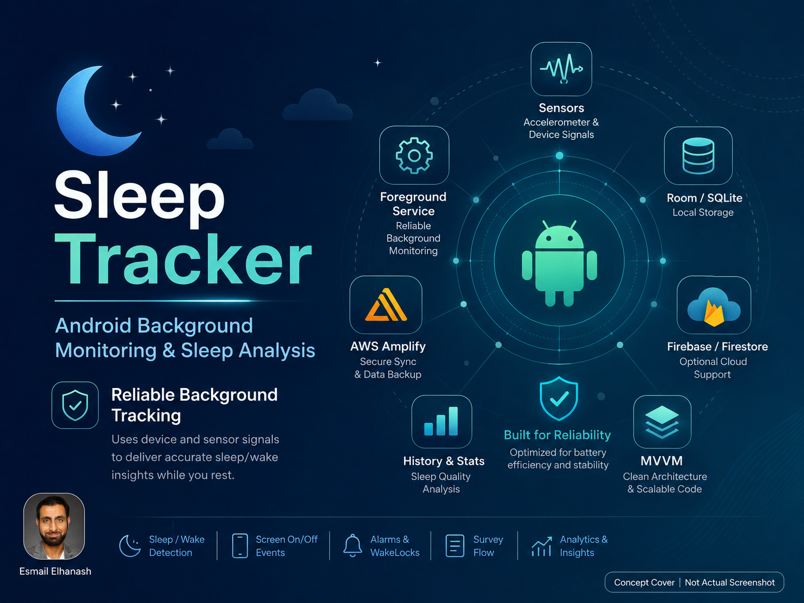

# SleepTracker

SleepTracker is a portfolio project showcasing an Android sleep monitoring concept built around background tracking, device signal collection, local persistence, and sleep/wake analytics. This repository is intended as a project showcase rather than a ready-to-run app or public setup guide.

## Screenshot

